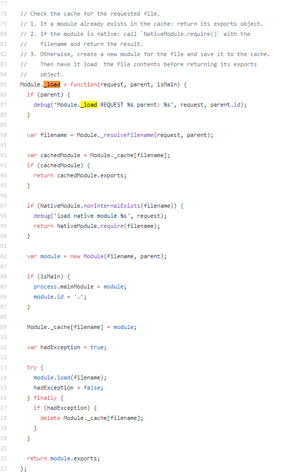

### 本文内容
- 1.什么是模块？  
- 2.为什么需要模块化？  
- 3.Javascript模块化之-Commonjs
- 4.Javascript模块化之-AMD
- 5.Javascript模块化之-ES module 
- 6.几种模块化比较

### 1.什么是模块？
模块,又称构件,是能够单独命名并独立地完成一定功能的程序语句的集合（即程序代码和数据结构的集合体）。它具有两个基本的特征：外部特征和内部特征。外部特征是指模块跟外部环境联系的接口（即其他模块或程序调用该模块的方式，包括有输入输出参数、引用的全局变量）和模块的功能；内部特征是指模块的内部环境具有的特点（即该模块的局部数据和程序代码）。   
简而言之，就是一个具有独立作用域，对外暴露特定功能接口的代码集合。

### 2.为什么需要模块化？
首先让我们回到过去，看看原始js模块文件的写法
```javascript
// add.js
function add(a, b) {
  return a + b;
}
// decrease.js
function decrease(a, b) {
  return a - b
}


// formula.js
function square_difference(a,b) {
  return add(a,b) * decrease(a,b);
}
```
上面我们在三个js文件里面，实现了几个功能函数，其中，第三个功能函数需要依赖第一个和第二个js的功能函数，所以我们在使用的时候，一般会这样写
```html
<html lang="en">
<head>
  <meta charset="UTF-8">
  <meta name="viewport" content="width=device-width, initial-scale=1.0">
  <meta http-equiv="X-UA-Compatible" content="ie=edge">
  <title>Document</title>
</head>
<body>
    <script src="add.js"></script>
    <script src="decrease.js"></script>
    <script src="formula.js"></script>
    <!--使用-->
    <script>
       var result = square_difference(3, 4);
    </script>
</body>
</html>
``` 
这样的管理方式会造成以下几个问题
- 1.模块的引入顺序可能会出错
- 2.会污染全局变量
- 3.模块之间的依赖关系不明显

基于上述的原因，就有了对上述问题的解决方案，即是Javascript模块化规范，目前主流的有Commonjs,AMD,CMD,ES6 Module这四种规范。

### 3.Javascript模块化之-CommonJs
CommonJs规范的主要内容有，一个单独的文件就是一个模块。每一个模块都是一个单独的作用域,模块必须通过module.exports导出对外的变量或接口，通过require()来导入其他模块的输出到当前模块作用域中，下面讲述一下Node是如何实现Commonjs的。 
- a.使用方式  
```javascript
  // 模块定义add.js
  module.eports.add = function (a, b) {
    return a + b;
  }

  // 模块定义 decrease.js
  module.exports.decrease = function (a, b) {
    return a - b;
  }
  
  // formula.js,模块使用，利用require()方法加载模块,require导出的即是module.exports的内容
  const add = require('./add.js').add
  const decrease = require('./decrease.js').decrease
  module.exports.square_difference = function(a,b) {
    return add(a,b) * decrease(a, b);
  }

```
- b. exports 和module.exports  
exports和module.exports是指向同一个东西的变量，即是module.exports === exports = {},所以你也可以这样导出模块
```javascript
  //add.js
  exports.add = function (a, b) { 
    return a + b;
  }
```
但是如果直接修改exports的指向是无效的，eg:
```javascript
  // add.js
  exports = function (a, b) {
    return a + b
  }
  // main.js
  var add = require('./add.js')
```
此时add是未定义的，因为require导入的是，对应模块的module.exports的内容，在上面的代码中，虽然一开始exports === module.exports,但是当执行
```javascript
  exports = function (a, b) {
      return a + b
  }
```
代码的时候，其实就将exports指向了function,而module.exports的内容并没有改变，所以这个模块的导出为空对象。

- c.Node的模块实现  
在Node中引入模块(require)，需要经历如下3个步骤  
(1).路径分析  
(2).文件定位  
(3).编译执行  
与前端浏览器会缓存静态脚本文件以提高性能一样，Node对引入过的模块都会进行缓存，以减少二次引入时的开销，不同的是，浏览器仅缓存文件,而Node缓存的是编译和执行后的对象。

(1)(2).路径分析 + 文件定位   
其流程如下图所示    
  

(3).模块编译  
在定位到文件后，首先会检查该文件是否有缓存，有的话直接读取缓存，否则，会新创建一个Module对象，其定义如下。
```javascript
function Module (id, parent) {
  this.id = id; // 模块的识别符，通常是带有绝对路径的模块文件名。
  this.exports = {}; //表示模块对外输出的值
  this.parent = parent; //返回一个对象，表示调用该模块的模块。
  if (parent && parent.children) {
    this.parent.children.push(this);
  }
  this.filename = null;
  this.loaded = false; // 返回一个布尔值，表示模块是否已经完成加载。
  this.childrent = []; //返回一个数组，表示该模块要用到的其他模块。
}
```
生成对象后设置缓存，会执行指定的处理函数，如下所示   
     
  
这里解析模块路径，判断是否有缓存，生成module对象    
       

得到模块对象后，执行载入操作(如果未缓存的话)      
    

在这里同步读取模块，再执行编译操作,   
  
    
编译过程主要做了以下的操作  
1.将js代码用函数体包装，隔离作用域，例如
```javascript
  //add.js
  exports.add = function (a, b) { 
    return a + b;
  }
  // 会被包装成
  (function (exports, require, modules, __filename, __dirname) {
    exports.add = function (a, b) { 
      return a + b;
    }
  })
```
2.执行函数，注入变量对象的exports属性, require属性，对象实例，__filename, __dirname，然后执行模块的源码。  
3.返回模块对象exports属性。
以上就是Node中Commonjs的实现。

### 4.Javascript模块化之-AMD  
AMD, Asynchronous Module Definition，即异步模块加载机制，它采用异步方式加载模块，模块的加载不影响它后面语句的运行。所有依赖这个模块的语句，都定义在一个回调函数中，等到加载完成之后，这个回调函数才会运行。  

AMD 的诞生，就是为了解决这两个问题：  
1.实现js文件的异步加载，避免网页失去响应  
2.管理模块之间的依赖性，便于代码的编写和维护    
```javascript
 // 模块定义
 define(id?: String, dependencies?: String[], factory: Function|Object);
```
id 是模块的名字，它是可选的参数。

dependencies 指定了所要依赖的模块列表，它是一个数组，也是可选的参数，每个依赖的模块的输出将作为参数一次传入 factory 中。如果没有指定 dependencies，那么它的默认值是 ["require", "exports", "module"]。

factory 是最后一个参数，它包裹了模块的具体实现，它是一个函数或者对象。如果是函数，那么它的返回值就是模块的输出接口或值，如果是对象，此对象应该为模块的输出值。

举个例子
```javascript
 //模块定义，add.js
  define(function(){
    let add = function (a, b) {
      return a + b;
    }
    return add
  }) 

 //模块定义，decrease.js
 define(function() {
  let decrease = function (a, b) {
    return a - b;
  }
  return decrease
 });

 //模块定义，square.js
 define([
  './add',
  './decrease'
], function(add, decrease) {
   let square = function (a, b) {
     return add(a, b) * decrease(a, b);
   }
   return square;
});

// 模块使用，主入口文件 main.js
require(['square'], function(math) {
  console.log(square(6, 3))
});
```
requirejs源码较为复杂，这里只对异步模块加载原理做一个分析，在加载模块的过程中， requiejs会调用如下函数  
```javascript
  /**
     * Does the request to load a module for the browser case.
     * Make this a separate function to allow other environments
     * to override it.
     *
     * @param {Object} context the require context to find state.
     * @param {String} moduleName the name of the module.
     * @param {Object} url the URL to the module.
     */
    req.load = function (context, moduleName, url) {
        var config = (context && context.config) || {},
            node;
        if (isBrowser) {
            //In the browser so use a script tag
            node = req.createNode(config, moduleName, url);

            node.setAttribute('data-requirecontext', context.contextName);
            node.setAttribute('data-requiremodule', moduleName);
            if (node.attachEvent &&
                    !(node.attachEvent.toString && node.attachEvent.toString().indexOf('[native code') < 0) &&
                    !isOpera) {
                useInteractive = true;

                node.attachEvent('onreadystatechange', context.onScriptLoad);
            } else {
                node.addEventListener('load', context.onScriptLoad, false);
                node.addEventListener('error', context.onScriptError, false);
            }
            node.src = url;

            if (config.onNodeCreated) {
                config.onNodeCreated(node, config, moduleName, url);
            }

            currentlyAddingScript = node;
            if (baseElement) {
                head.insertBefore(node, baseElement);
            } else {
                head.appendChild(node);
            }
            currentlyAddingScript = null;

            return node;
        } else if (isWebWorker) {
            try {
                //In a web worker, use importScripts. This is not a very
                //efficient use of importScripts, importScripts will block until
                //its script is downloaded and evaluated. However, if web workers
                //are in play, the expectation is that a build has been done so
                //that only one script needs to be loaded anyway. This may need
                //to be reevaluated if other use cases become common.

                // Post a task to the event loop to work around a bug in WebKit
                // where the worker gets garbage-collected after calling
                // importScripts(): https://webkit.org/b/153317
                setTimeout(function() {}, 0);
                importScripts(url);

                //Account for anonymous modules
                context.completeLoad(moduleName);
            } catch (e) {
                context.onError(makeError('importscripts',
                            'importScripts failed for ' +
                                moduleName + ' at ' + url,
                            e,
                            [moduleName]));
            }
        }
    };

    req.createNode = function (config, moduleName, url) {
        var node = config.xhtml ?
                document.createElementNS('http://www.w3.org/1999/xhtml', 'html:script') :
                document.createElement('script');
        node.type = config.scriptType || 'text/javascript';
        node.charset = 'utf-8';
        node.async = true;
        return node;
    };
```
可以看出，这里主要将指定的模块，根据url，创建了一个异步的script标签，并将模块id名称添加到的标签的data-requiremodule上，再添加到了html页面中，同时为script标签的load事件添加了处理函数，当该script标签被加载完毕的时候，就会触发context.onScriptLoad。添加完之后，页面就会加载js资源，然后加载完毕的时候调用context.onScriptLoad。我们再onScriptLoad添加断点，可以看到页面如下所示。  
  
有图可以看到，html中添加了一个script标签，这也就是异步加载模块的原理。

### Javascript模块化之-CMD
CMD(Common Module Definition) 通用模块定义,CMD在浏览器端的实现有sea.js， 和requirejs一样。sea.js加载原理也是动态创建异步script标签。二者的区别主要是依赖写法上不同，ADM推崇一开始就加载所有的依赖，而CMD则推崇在需要用的地方才进行依赖加载。
```javascript
// ADM 在执行以下代码的时候，requiejs会首先分析依赖数组，然后依次加载，直到所有加载完毕再执行回到函数
define(['add', 'decrease'], function(add, decrease){
   let result1 = add(9 ,7);
   let result2 = decrease(9 ,7)
   console.log(result1 * result2)
});

// CMD 在执行以下代码的时候， sea.js会首先用正则匹配出代码里面所有的require语句，拿到依赖，然后依次加载，加载完成再执行回调函数
define(function(require){
   let add = require ('add')
   let result1 = add(9 ,7);
   let add = require ('decrease')
   let result2 = decrease(9 ,7)
   console.log(result1 * result2)
});
```

### 5.Javascript模块化之-ES Module 
ES Module，是在ECMAScript 6 (ES6)中，引入的模块化功能。  
模块功能主要由两个命令构成：export和import,export命令用于规定模块的对外接口，import命令用于输入其他模块提供的功能。

其使用方式如下
```javascript
 // 模块定义 add.js
 export function add(a, b){
    return a + b;
 }

 //模块使用 main.js
 import {add} from './add.js'
 console.log(add(1,2)) // 3

```
下面讲述几个较为重要的点   
a. export 和 export default  
 -1.在一个文件或模块中，export可以有多个，export default仅有一个, export类似于具名导出，而default类似于导出一个变量名为default的变量，同时在import的时候，对于export的变量，必须要用具名的对象去承接，而对于default，则可以任意指定变量，如下所示  
 ```javascript
 // a.js
  export var a = 2;
  export var b = 3 ;
// main.js 在导出的时候必须要用具名变量 a, b且用解构的方式得到导出变量
import {a, b} from 'a.js' // √ a= 2, b = 3
import a from 'a.js' // x

// b.js export default 方式
const a = 3
export default a // 注意不能 export default const a = 3 ,因为这里default就相当于一个变量名

// 导出
import b form 'b.js' // √
import c form 'b.js' // √ 因为b模块导出的是default，对于导出的default，可以用任意变量去承接
 ```

 b.ES Module 模块加载和导出过程
 以如下代码为例子  
 ```javascript
  // counter.js
  export let count = 5

  // display.js
  export function render() {
    console.log('render')
  }
  //main.js
  import {counter} from './counter.js';
  import {render} from './display.js'
  ......// more code
 ```
 在模块加载模块的过程中，主要有以下几个步骤：  
  - 1.构建(Construction)   
  这个过程执行查找，下载，并将文件转化为模块记录(Module record),所谓的模块记录是指一个记录了对应模块的语法树，依赖信息，以及各种属性和方法(这里不是很明白)，同样也是在这个过程对模块记录进行了缓存的操作，下图是一个模块记录表  
    

  下图是缓存记录表  
    


- 2.实例化(Instantiation)    
  这个过程会在内存中开辟一个存储空间(此时还没有填充值)，然后将该模块所有的export和import了改模块的变量指向这个内存，这个过程叫做链接。其写入export示意图如下所示  
      
  然后是链接import,其示意图如下所示   
      
 
- 3.赋值(Evaluation)  
  这个过程，会执行模块代码，并用真实的值填充上一阶段开辟的内存空间,此过程后，import链接到的值就是export导出的真实值。

根据上面的过程我们可以知道。ES Module模块export 和import其实指向的是同一块内存，但有一个点需要注意的是，import处不能对这块内存的值进行修改，而export可以,其示意图如下。  


### 6.几种模块化比较
最后再对几种模块化做个比较  

模块化方案 | 加载方式 | 适用端|何时加载|
---- | --- | --- | --- |
Commonjs | 同步|服务端|运行时|
AMD | 异步|浏览器|运行时|
ES Module | 异步/同步 | 服务端/浏览器端|编译时|  


参考文章:
[ES modules: A cartoon deep-dive](https://hacks.mozilla.org/2018/03/es-modules-a-cartoon-deep-dive/)


