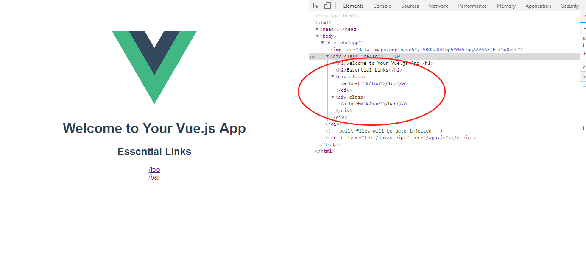

## 谈谈前端路由
  在前端开发的过程中，路由常常是一个常见的功能。今天就让我们来聊聊前端路由，本文将从前端路由介绍讲起，到浏览器路由 API 的讲解，最后分析一下 vue-router 的基本原理。这篇文章主要包含以下几部分的内容。 
  1. 前端路由介绍 
  2. 浏览器路由 API - history
  3. 浏览器路由 API - hash
  4. vue-router 路由基本原理
  5. 两种路由方式的异同点


### 前端路由介绍
  在早起的前后端尚未分离的时候，前端的路由一般是由后端控制，后端通过将路由和对应的页面模板进行匹配，返回一整个页面给浏览器，浏览器拿到页面后刷新，从而实现访问不同的地址得到不同页面的逻辑。随着 AJAX(异步数据更新) 技术的出现，前端逐渐开始主导路由的控制。

### 浏览器前端路由 API - History
 History 是 HTML5 新增的浏览器全局 API,  该接口允许用户操作浏览器的曾经在标签页或者框架里访问的会话历史记录。History 对象主要有以下的几个方法，同时 HTML5 也新增了一个 popstate 的全局事件，这个事件会在当活动历史记录更改的时候触发。

- History.back()  
前往上一页, 相当于用户点击了浏览器左上角的返回按钮. 也等价于 history.go(-1)。

- History.forward()  
在浏览器历史记录里前往下一页，相当于用户点击了浏览器左上角的前进按钮. 等价于 history.go(1).

 - History.go()  
 通过当前页面的相对位置从浏览器历史记录( 会话记录 )加载页面。比如：参数为-1的时候为上一页，参数为1的时候为下一页. 当整数参数超出界限时，该操作无效果，当传 0 的时候相当于刷新页面。

 - History.pushState()  
 该方法用于在历史中添加一条记录，其使用方式为:

 ```javascript
 history.pushState(state, title, url)
 // 其中三个参数的意义分别为
 state: object // 一个与被添加的记录关联的对象。在 popstate 事件中可以得到对应的 state 对象的副本
 title: string // 新页面的标题。但是，现在所有浏览器都忽视这个参数
 url: string // 新的网址，必须与当前页面处在同一个域(否则会失败报错),浏览器的地址栏将显示这个网址。
 ```
 执行该语句后，会往 histroy 对象里面添加一条新的记录，浏览器地址栏将显示新的地址，但是并不会加载新的文档，甚至不会检查该地址是否存在。

 - history.replaceState()
 该方法和 pushState 类似，不同的是， replaceState 修改 History 对象的当前记录。


 - popstate 事件  
这个事件是一个全局事件，每当同一个文档的浏览历史（即history对象）出现变化时，就会触发popstate事件，但是仅仅调用pushState()方法或replaceState()方法 ，并不会触发该事件，只有用户点击浏览器倒退按钮和前进按钮，或者使用 JavaScript 调用History.back()、History.forward()、History.go()方法时才会触发。

其使用方式如下:
```javascript
window.addEventListener('popstate',function() {
    console.log('history change')
    console.log(event.state) // 打印当前记录的 state 对象
});
history.pushState({state: 1}, '', '/foo')
history.pushState({state: 2}, '', '/bar')
history.pushState({state: 3}, '', '/test') // 当前记录为 '/test', state = {state: 3}

history.back() // 回退，当前记录为 '/bar' 所以打印结果为: history change {state: 2}
history.back() // 回退，当前记录为 '/foo' 所以打印结果为: history change {state: 1}
history.back() // 回退当初始页面，初始页面的 state 为 undefined, 所以打印结果为 history undefined
```
利用 History API 和 popstate 事件，结合 AJAX, 我们可以实现在不刷新页面的情况下切换路由和更新页面。 

### 浏览器路由 API - hash
所谓 hash, 即是字符串URL 的锚部分, 比如一个地址链接为 http://www.example.com/#/page1, 那么气 hash 值为 location.hash = '#/page1'。以 hash 作为路由一个好处是，hash 值部分的内容不会提交到服务，也就如果只改变 hash 部分，那么浏览器不会发送新的请求，且该 hash 记录会被添加到浏览器的访问历史记录中。例如：   

```javascript
// 假设当前路径为 www.example.com
location.hash = 'page1' // 路径变为 www.example.com/#page1
location.hash = 'page2' // 路径变为 www.example.com/#page2
location.hash = 'page3' // 路径变为 www.example.com/#page3

history.length // 4， 上述的操作改变了访问的历史记录， 所以也会触发 popstate 事件
history.back() // 路径变为 www.example.com/#page2
history.back() // 路径变为 www.example.com/#page1
history.forward() // 路径变为 www.example.com/#page2
```
另外 hash 值也常常作为定位到页面某个元素的锚点。

 - hashchange 事件  
hashchange 事件是 HTML5 新增的事件，当 url 处的哈希值改变的时候，便会触发此事件。例如:  
```javascript
window.addEventListener('hashchange',function() {
  console.log(location.href)
  console.log('hash change')
});
// 假设当前路径为 www.example.com
location.hash = 'page1' //  www.example.com/#page1 hash change
location.hash = 'page2' //  www.example.com/#page1 hash change
history.pushState(null, null, '/bar') // www.example.com/bar, 不会触发 hashchange
```
hash 改变不会触发浏览器的请求的表现似乎天然适合前端路由，结合 AJAX 技术，前端可以完全的控制前端路由，但是 hash 这种路由控制的方式不利于搜索引擎。

### vue-router 路由基本原理
用过 vue-router 的同学都知道， vue-router 可以设置两个路由模式，分别是 history 和 hash。同时 vue-router 的文档中也有编程式 router.push()， router.replace()，router.go() 看起来是不是和上面的 history 类似的呢？所以我们有理由认为 vue-router 的实现应该是和 HTML5 history 和 location.hash 有着某种联系，下面就让我们一起来看看 vue-router 的内部到底做了什么？

- vue-router 的使用方式
1. 首先是定义路由规则，即是每个路由对应的组件
```javascript
// router/index.js
import Vue from 'vue'
import Router from 'vue-router'
import index from '@/components/index'
import foo from '@/components/foo'
import bar from '@/components/bar'
Vue.use(Router)

export default new Router({
  routes: [
    {
      path: '/',
      name: 'index',
      component: index
    },
    {
      path: '/foo',
      name: 'foo',
      component: foo
    },
    {
      path: '/bar',
      name: 'bar',
      component: bar
    }
  ]
})
```
2. 接下来是定义切换路由的界面
```javascript
// components/index.vue
<template>
  <div class="hello">
    <h1>{{ msg }}</h1>
    <h2>Essential Links</h2>
    <router-link to="/foo" tag="div">
      <a>/foo</a>
    </router-link>
    <router-link to="/bar" tag="div">
      <a>/bar</a>
    </router-link>`
  </div>
</template>

<script>
export default {
  name: 'HelloWorld',
  data () {
    return {
      msg: 'Welcome to Your Vue.js App'
    }
  }
}
</script>
// 可以看到上面使用了 vue-router 自带的路由组件 router-link 和 router-view
```
3. 然后是展示路由渲染结果的页面(主界面)
```javascript
// app.vue
<template>
  <div id="app">
    
    <router-view/>
  </div>
</template>

<script>
export default {
  name: 'App'
}
</script>
```
4. 最后是在实例化 vue 根组件的时候传入路由对象
```javascript
// main.js
import Vue from 'vue'
import App from './App'
import router from './router'
new Vue({
  el: '#app',
  router,
  components: { App },
  template: '<App/>'
})
```
其主界面运行结果如下图所示:  
  

从图中对比 app.vue 文件可知。vue-router 将 router-view 替换了首页路径下匹配的组件 components/index.vue， 同时 router-link 被渲染成了包含两个 a 标签的的 div。且 a 链接的地址分别渲染为 #/foo, #/bar,这是因为 vue-router 默认的模式是 hash 模式。


